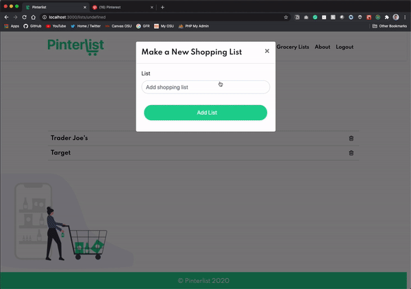

# Pinterlist 🥕

## Description

Pinterlist is a web application that turns Pinterest recipes into a grocery list.

Stack: MERN, Redux, Bootstrap 4

Deployment: Heroku

## Pinterlist in action!



## Usage

```bash
npm run dev
```

Pinterlist will then be live on localhost 3000

## Contributing

Pull requests are welcome. For major changes, please open an issue first to discuss what you would like to change.

Please make sure to update tests as appropriate.

## License

[MIT](https://choosealicense.com/licenses/mit/)

## Notes

If address is already in use run:

```bash
sudo killall -9 node
```
